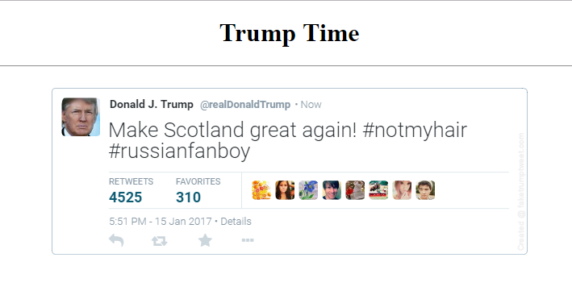

# Trump Needs Your Help !

Mr Donald J Trump, needs your help because he doesn't know how many hashtags are in his awesome tweets!



```javascript

var tweet = 'Make Scotland great again! #notmyhair #russianfanboy';
var tags = 0;

// Add Your Code Here

alert(tags);

```

You will need to set the variable TAGS to be equal to the number of hashtags in his tweets. You will need to use the following features.

+ For Loops
+ If Statements
+ The + operator

### Loop Statement
```javascript
for(var i = 0; i < 5; i++) {
	alert(i)
}
```


### If Statement
```javascript
if(5 > 0) {
	alert('5 is bigger than 0')
}
```

### + Operator
```javascript
var tags = 0
tags = tags + 1
// tags now equals 1
```


### Links

 * [FakeTrumpTweet](http://faketrumptweet.com/) -> Website for generating your tweets
 * [Loop Tutorial](http://www.w3schools.com/js/js_loop_for.asp) -> For Loop Example
 * [IF Tutorial](http://www.w3schools.com/js/js_if_else.asp) -> If Statement Example

